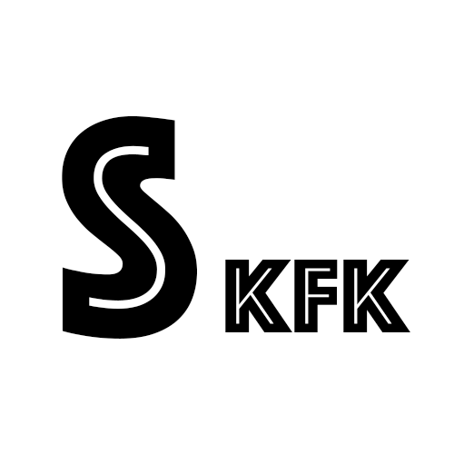

# Socket.IO-KFK

## Usage

### Install

```shell
npm install -S socket.io-kfk
```

### Use Adapter

```js
import * as IO from 'socket-io'
import { initKafkaAdapter } from 'socket.io-kfk'

// create socket.io server
const server = http.createServer()
const io = IO(server)

// init kafka adapter
const opts = {
	brokerList: '127.0.0.1:9092',
}
const adapter = initKafkaAdapter(opts)

// register into socket.io instance
io.adapter(adapter)
```

## Why not socket-io.redis?

`socket.io-redis` is a easy and awesome adapter in socket.io ecology. But it use redis as its internal message queue, which have poor performance when have huge events. And redis cluster have a simple PUB/SUB implement: [current implementation will simply broadcast each published message to all other nodes](https://redis.io/topics/cluster-spec). It make us feel hard to expand our socket.io cluster with redis adapter.

So, for the reason of scalability, I write this kafka version to make socket.io can handle more than 100k events/s messages.

## License

[MIT](https://github.com/joway/socket.io-kfk/blob/master/LICENSE)